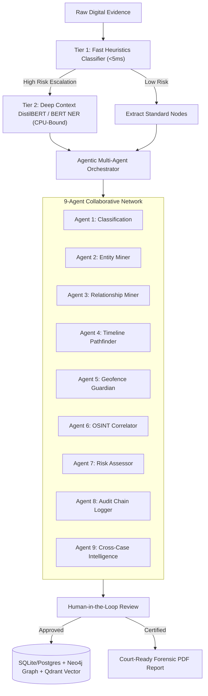

# 📣 ACPIA Project Pitch

### AI-Powered Digital Evidence Intelligence Platform for Child Protection Investigations

---

## 🚀 The 30-Second Elevator Pitch
> **"ACPIA (Agentic Child Protection Investigation Assistant) is a privacy-first, offline-ready forensic copilot designed for child protection and law enforcement agencies. By combining a tiered local AI pipeline with a relational knowledge graph and a 9-agent collaborative network, ACPIA automates the triage of massive volumes of digital evidence—mapping suspect-victim links, tracing geolocated timelines, and generating court-ready, audit-certified forensic reports completely offline."**

---

## ⚠️ The Problem
*   **Evidence Tsunami:** Investigators process terabytes of data (chat logs, GPS files, images) per case, creating severe backlogs.
*   **Air-Gapped Realities:** Forensic labs operate under strict offline conditions. Traditional cloud-based AI tools cannot be used due to victim privacy regulations and data leaks.
*   **Missed Inter-Case Links:** Suspects use alias phone numbers and devices across different jurisdictions, but siloed databases fail to catch cross-case connections.
*   **Chain of Custody Vulnerability:** Standard AI analysis lacks forensic validation and transparency, making results challengeable in court.

---

## 💡 The Solution: ACPIA
ACPIA runs **100% offline in air-gapped forensics labs**, acting as an intelligent digital copilot:

---

## 🛠️ Key Technical Capabilities

### ⚡ Tiered Local AI Pipeline
1.  **Tier 1: Fast Triage Classifier (<5ms):** A high-speed, local keyword & bag-of-words scanner that flags potential threats immediately.
2.  **Tier 2: Deep Context Transformer Inference:** When Tier 1 triggers an escalation, local CPU-bound Hugging Face models (**DistilBERT** for sentiment/intent analysis and **BERT** for Named Entity Recognition) extract relationships and pinpoint grooming or coercion patterns.
3.  **Local Fallback:** Robust backup heuristics ensure the platform works even when deep learning pipelines are disabled.

### 🕸️ Relational Knowledge Graph
*   **Dynamic Synchronization:** Seamlessly synchronizes relational nodes (`Person`, `Device`, `Phone`, `Email`, `Location`) and edges (`OWNS`, `LOCATED_AT`, `COMMUNICATES_WITH`) from SQLite/Postgres to a **Neo4j Graph Database**.
*   **Visual Network Mapping:** Instantly exposes suspect communication networks and victim-suspect links.

### 🗺️ Leaflet Timeline & Pathfinder
*   **Geotag Extractor:** Automatically extracts media and conversation location coordinates.
*   **Chronological Tracing:** Plots coordinates chronologically on an interactive map.
*   **Operational Geofencing:** Automatically calculates proximity alarms and geofence violations.

### 🔒 Chain of Custody & Forensic Rigor
*   **SHA-256 Integrity Verification:** Automatically hashes every file uploaded.
*   **Immutable Forensic Ledger:** Automatically tracks and timestamps every AI classification and investigator approval/rejection.
*   **One-Click PDF Dossiers:** Exports court-ready forensic reports containing full case details and the audit log.

---

## 🔑 Key Terminology & Buzzwords

*   **Privacy-by-Design:** Complete data privacy since no data ever leaves the local network.
*   **Tiered Offline Triage:** Cascading AI pipelines that process low-risk data instantly and escalate high-risk content for deep learning inference.
*   **Cross-Case Intelligence Matcher:** Correlates identifiers (e.g., matching phone numbers or device IDs) across separate historical investigations.
*   **Human-in-the-Loop Safeguards:** AI suggestions require investigator approval, maintaining legal accountability and audit trails.
*   **Air-Gapped Forensics Copilot:** Fully functional offline AI deployment for highly sensitive law enforcement networks.
*   **Relational Graph Alignment:** Automatically maps raw text identifiers into Neo4j graph nodes.

---

## 💬 Important Lines & Key Talking Points

> **On Victim Privacy & Security:**
> *"ACPIA doesn't connect to the internet. We bring the AI models to the evidence, not the evidence to the cloud. This preserves victim confidentiality and guarantees 100% compliance with data privacy regulations."*

> **On Investigator Efficiency:**
> *"Investigators are drowning in data. ACPIA cuts down search time from days to seconds by automatically triaging evidence, highlighting coercion patterns, and suggesting the suspect's network graph."*

> **On Legal Admissibility:**
> *"Every single entity connection mapped by ACPIA's AI has a corresponding SHA-256 verified audit record and human investigator approval. We don't just find links; we build a court-ready, legally defensible chain of custody."*

> **On Cross-Case Analysis:**
> *"A groomer doesn't stop at city limits. ACPIA matches communication aliases and device IDs across different cases, connecting the dots that human investigators might miss across separate local districts."*
